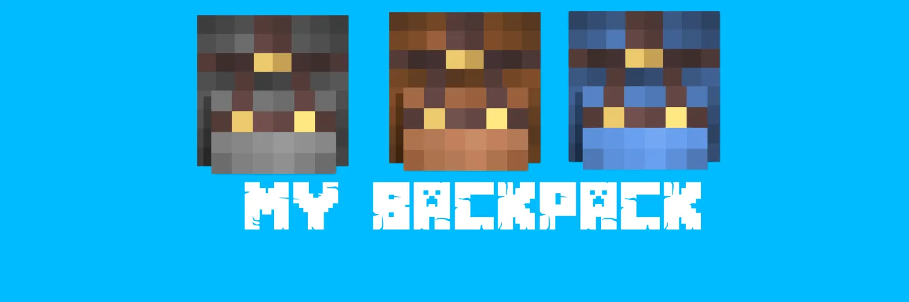
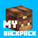

<div align="center">
  
  <br><br>
  
  <h1>MYBackpack</h1>
  <p><strong>it's your Backpack</strong></p>
  <p>A multi-tier backpack plugin for Spigot 1.21.4. Craft, carry, and organize your items with style.</p>
  <p>
    <a href="https://modrinth.com/plugin/mybackpack">
      
    </a>
    <a href="https://github.com/yossef1st/MYBackpack">
      
    </a>
  </p>
</div>

## Features

- 4 backpack tiers: Small, Medium, Large, Ender
- Unique player head textures per tier
- Each backpack has its own separate inventory (stored in PDC)
- Backpacks never stack (max stack size: 1)
- Auto-collect items on pickup (Shift + Right-Click to toggle)
- Ender Backpack opens the player's real Ender Chest
- Custom crafting recipes displayed in the recipe book
- Bilingual: Arabic (default) / English

## Commands

| Command | Description | Permission |
|---------|-------------|------------|
| `/backpack give <player> <tier>` | Give a backpack to a player | `backpack.admin` |
| `/backpack reload` | Reload config.yml | `backpack.reload` |

## Permissions

| Permission | Default | Description |
|------------|---------|-------------|
| `backpack.admin` | `op` | Allows /backpack give |
| `backpack.use` | `true` | Allows right-click to open backpacks |
| `backpack.reload` | `op` | Allows /backpack reload |

## Crafting Recipes

### Small Backpack (18 slots)

```
LLL   L = Leather
LCL   C = Chest
ILI   I = Iron Block
```

### Medium Backpack (27 slots)

```
DDD   D = Diamond
DBD   B = Small Backpack
DDD
```

### Large Backpack (54 slots)

```
NNN   N = Netherite Ingot
NXN   X = Medium Backpack
NNN
```

### Ender Backpack

```
EOE   E = Ender Eye
OCO   C = Ender Chest
EOE   O = Obsidian
```

## Building

Requirements: Java 21, Maven

```bash
mvn package
```

The JAR will be in `target/MYBackpack.jar`.

## Installation

1. Place `MYBackpack.jar` in your server's `plugins/` folder
2. Restart the server
3. Configure `plugins/MYBackpack/config.yml`

## Configuration

The config file supports:

- `lang`: `ar` (Arabic) or `en` (English)
- Backpack tiers (name, lore, size, texture, recipe)
- Recipe shapes and ingredients

### Language

Set the language in `config.yml`:

```yaml
lang: ar   # العربية
lang: en   # English
```

## How to Use

1. **Craft** a backpack using the recipes above
2. **Right-Click** to open the backpack inventory
3. **Shift + Right-Click** to toggle auto-collect mode
4. Items placed inside are saved per backpack

## Auto-Collect

When auto-collect is enabled (item held in main or off hand), items you pick up go directly into the backpack.

## Credits

Created by YOSSEF_1ST using opencode
